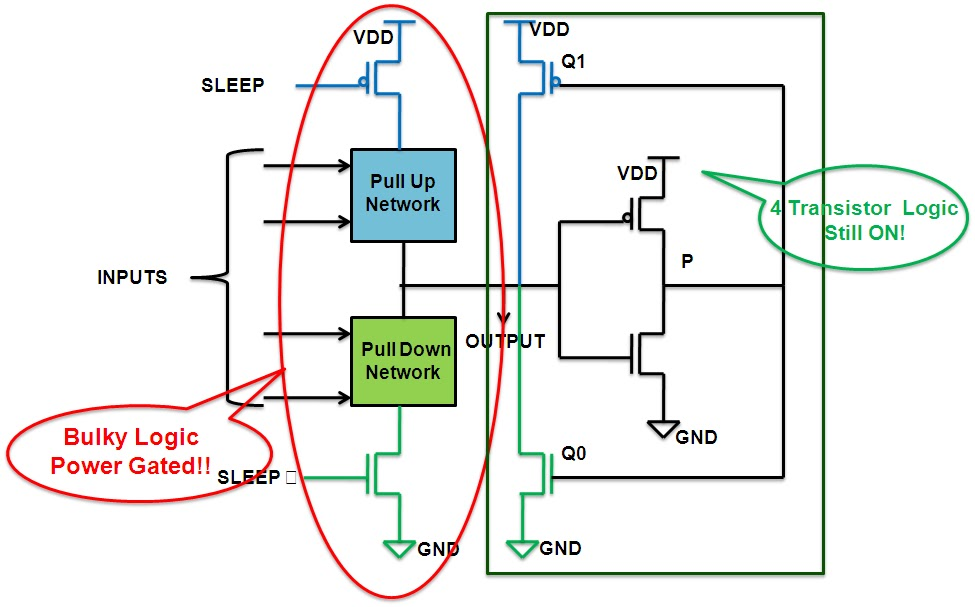
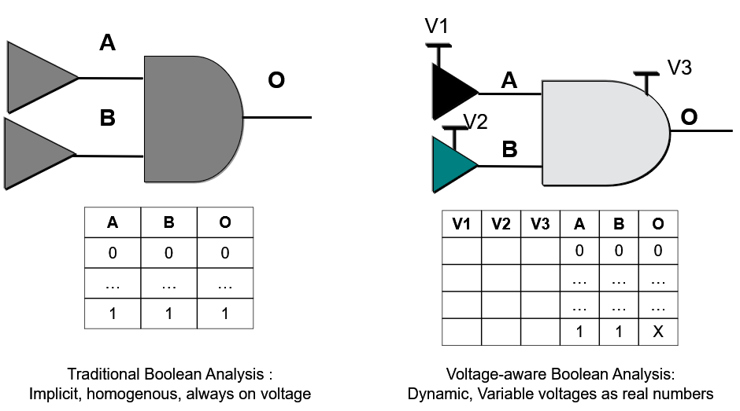
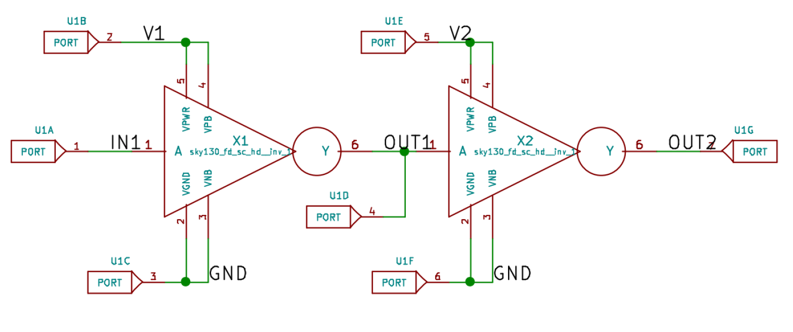
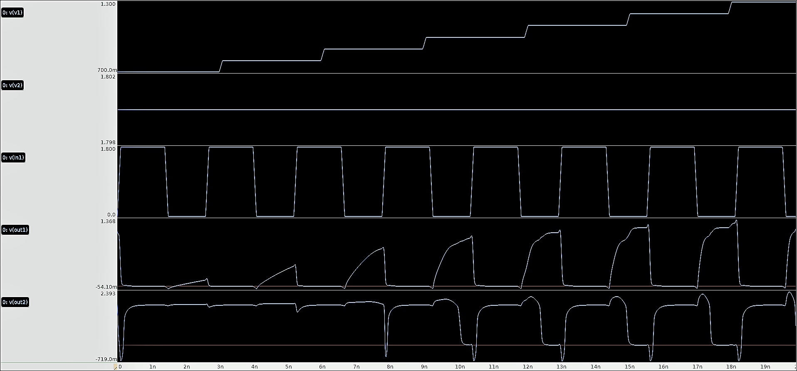
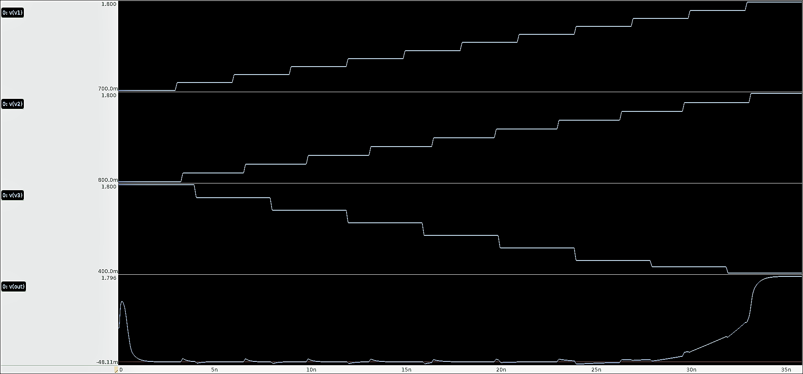

# **Low Power Design Workshop By Srikanth Jadcherla and VLSI Systems Design**

One of my professors used to say "Make either a big chip or a fast chip but never a bigger and faster chip". If its both big and fast it will generate lot of heat and probably fail. Pentium 4 "Prescott" is classic example (almost 3-4x more transistors, increased die size and frequency aimed to achieve 4GHz), consumed 100 - 150 Watts of leakage power (1). 

Until a year ago I used to undervolt my CPU by about 115mV and that would give me constant performance of 4.0+ GHz, without undervolting I would run into thermal throttling issues. Essentially it will decrease the dynamic power, enabling cooler temperature and better performance. The need for Low power systems is evident from this. Unfortunately because of the Plundervolt bug, Intel and Dell decided to block that feature and thus my CPU thermal throttles.

We are heading towards handheld devices, for them to be efficient we need to optimize power consumption. The workshop provided me with a basic understanding of various techniques used to achieve Low power consumption and verification of those said techniques.

>## Workshop Curriculum
> ### Module 1 : Introduction
> 1. Why Low power design?
> 2. Low Power Fundamentals
> 3. CMOS Recap
> ### Module 2 : 
> 1. Low Power Implementations
> 2. Voltage Control Techniques
> ### Module 3
> 1. State space Basics
> 2. Multi-Voltage Terminology
> ### Module 4 
> 1. Voltage aware booleans
> 2. Power management and Typical Errors
> 3. Verification strategies of MV designs
> ### Module 5
> 1. Island Ordering
> 2. Mobile and Mobility

 
 

> ### CMOS Basics
Early microprocessors like Intel 4004 were pure NMOS design. Lack of complementary devices (PMOS and NMOS) in a pure NMOS tech made realization of inverters with zero static power non-trivial. Hence, in 1980s shift to CMOS was made. CMOS are voltage controlled devices, primary reason to be used in Low power design 

**State of Design Elements**
|        |Combinational Logic| Sequential Logic|
|--------|-------------------|-----------------|
|Shutdown|OFF|OFF|
|Standby |ON |Reads allowed but not writes|
|Active  |ON |Reads and Write allowed|

 

> ### Power
 
Power consumed by an SOC implies the switching power proportional to the activity and static power, also known as Leakage power.

 
**Dynamic power:** Power required to charge and discharge the output capacitance. VDD decreases with every node, should reduce dynamic power, but increase in number of transistors negates the reduction in VDD.

**Static Power /Leakage Power:** Power consumed when idle, it could be because of various factors (2)
1. Subthreshold Current
2. Drain induced Barrier Lowering
3. Punchthrough
4. Thin Oxide Gate Tunneling
5. Gate Induced Gate Leakage
6. PN Junction Current
7. Hot Carrier Injection

**Energy** is power consumed per unit time, it's the capacity that is packed. Directly affects weight and cost, indirectly affects form factor. So how much is enough?

**Power Management** is often the problem of Density, Delivery, Leakage and Lifetime
1. **Density:** is power consumed in unit area, meaning heat generated, meaning cost required to dissipate heat. High density close to batteries has caused fires in cellphones and laptops.
2. **Delivery:** is the amount of current that needs to be delivered. As Vdd decreases current delivery increases. Hence, delivery is commonly known as IR drop and di/dt problems.
3. **Leakage:** is the power consumed when idle. In higher technology nodes this was insignificant, but in sub-micron and deep sub-micron designs because of second order effects this is a significant problem. 
4. **Lifetime:** is reliability problem because of ever shrinking technology node. The chip cannot fail because of this, designer has to ensure reliable operation for defined period.

 

> ### Case Study
> 1. Thermal Runaway - Why Samsung phones caught fire?
> 2. Cost and Characteristics of Fans Mounted on CPU
> 3. Iphone 6 Battery Degradation Law suit

 

> ## Multi - Voltage Terminology
**1. Rail:** A Virtual or Physical network connected to the output of a Voltage Source. 
**2. Island:** is a set of logic elements with 7 rail connections.  
**3. Well:** is a set of cells with common bulk connections for both PMOS and NMOS. 
**4. Domain:** is the drain of the driver. It indicates which primary rails are driving the signal. 
**5. Spatial Crossing:** is a signal sourced in one island and has a destination in another. 
**6. Temporal Variation:** is the variation of rail over time. 
**7. Isolation:** is a technique to protect a receiving island that is active from a signal originating in an island that is turned off.    
**8. Input Isolation/ Parking:** is a technique to arrest input toggles in an island. 
**9. Level Shifter:** is a technique to convert a signal driven by one set of primary rails to another set of primary rails on a spatial crossing.  

 

> ### Voltage Control Techniques
 There are only 7 ways the CMOS voltage can be controlled, it's as shown below 
 
By varying any of these, applied voltage thus the output voltage level can be controlled.

**Power Management Techniques**
1. **Clock Gating:** Clock trees are responsible for a significant portion of dynamic power. The most common way to reduce this is to switch off the clocks when not in use. This technique is called Clock Gating. 
2. **Multi-threshold:** Leakage depends exponentially on VTH. Many PDK have multi-Vt cells. The idea is to replace non-critical path cells with slow, less leaky High VTH cells. There by minimizing the leakage.    
3. **Multi-Voltage:** Dynamic power is proportional to VDD2. Hence, lowering VDD decreases dynamic power significantly, but also makes the gates slower.  
Consider an example, Timing critical components like cache can be run at max voltage, the CPU can be run at a slightly reduced voltage and other non-critical components can be run at further reduced voltage. This will provide significant power reduction.  

4. **Power Gating:** Leakage power is increasing with new technology node, since we are moving towards more efficient hand held devices the need for reducing leakage power is higher. One of the ways to achieve that is to switch off the block that are not in use. This technique is called Power Gating. 
 
Adding the Header/Footer will remove direct path to power rails when power gated. Thus, reducing leakage current.
The idea is to provide two modes, low power and active mode. The goal is to switch between the two when appropriate to maximum power savings without impacting performance. 
 During power gating if cache contents are lost, refilling the cache takes time and more power. So net power savings will be reduced. It is also better to have state retention of critical components when power gating. 
5. **Power Gating with State Retention:** This techniques builds on power gating and provides quick state restore by utilizing shadow flip flops or scan chains. 
 
6. **Dynamic or Adaptive Voltage Frequency Scaling:** This technique provides reduction in dynamic power by scaling just voltage called Dynamic Voltage scaling (DVS) or both voltage and frequency called Dynamic voltage and Frequency Scaling (DVFS) or Adaptive voltage and frequency scaling (AVFS). We know that dynamic power is proportional to frequency and square of voltage, reducing clock frequency will provide proportional power reduction, voltage provides much better reduction. Thus using these two together will provide the lowest possible power consumption.  
7. **Low VDD Standby:** VDD is lowered just enough to have the memory elements retain their state. The outputs have to have level shifter.  
 
> ### State Space and Retention
On the hardware level we have a state retention capable ciruit, but we should ask when and how this state is retained. It can be accomplished either by Hardware or by Software. Irrespective of the method the idea remains the same. An example below
 
 
> ### Voltage Aware Booleans 
It provided modeling ability closer to physics and also made for a better understanding of mixed signal power management elements and digital design elements. This has to be analyzed using the CMOS operating states.    
> ### Power Management and Bugs
> ### Verification Strategies of MV Design
> ### Island Ordering and Mobility
> ### Labs
Three circuits were simulated to understand the need for low power design techniques.
1. **Inverter:** Inverter chain with two separate domains, V2 domain is ramped up and we can see the output of island 2 after CMOS starts conducting. 

 
    
2. **Nand:** Here Vdd and the input voltages V1 and V2 are varied, Vdd and V1 are ramped up while V2 is ramped down. When V1 is low, the output should be high, since the Vdd is also low the CMOS are not conducting. V2 is low and Vdd is sufficiently high, we see the output slowly rise to high.
 
 
 
3. **4bit Shift Register:**

References:
1. Verification Methodology Manual for Low Power - Srikanth Jadcherla, Janick Bergeron, Yoshio Inoue and David Flynn
2. ECE410, Prof Andrew Mason, Michigan State University 
3. [The Quest for More Processing Power, Part One: "Is the single core CPU Doomed?"](https://www.anandtech.com/show/1611)
4. [Leakage and Low Power, R Saleh, UBC Canada](https://courses.ece.ubc.ca/579/579.lect6.leakagepower.08.pdf)
5. [George Sobral Silveira, Alisson V. Brito, Helder F. de A. Oliveira, Elmar U. K. Melcher, "Open SystemC Simulator with Support for Power Gating Design", International Journal of Reconfigurable Computing, vol. 2012, Article ID 793190, 8 pages, 2012.](https://doi.org/10.1155/2012/793190)
6. [Power Gating with Retention](http://vlsi-soc.blogspot.com/2013/03/state-retention-power-gating.html)

